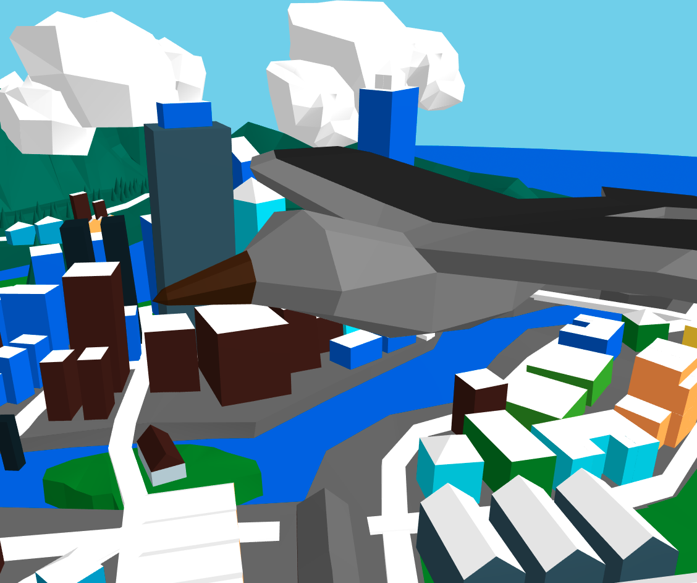

# Flappy Gull
Fly around as a bird in VR together with others!

This project was created during a WebVR games workshop at a symposium.
The original idea was based on a combination between the *Fly Like a Bird* games and *Flappy Bird*.
However, the flapping mechanic was removed and replaced with gliding, since it turns out flapping up and down is horrible in VR, who knew?

Mirror of [glitch.com/edit/#!/flappygull-multiplayer](https://glitch.com/edit/#!/flappygull-multiplayer)

View live site: [flappygull-multiplayer.glitch.me](https://flappygull-multiplayer.glitch.me)

